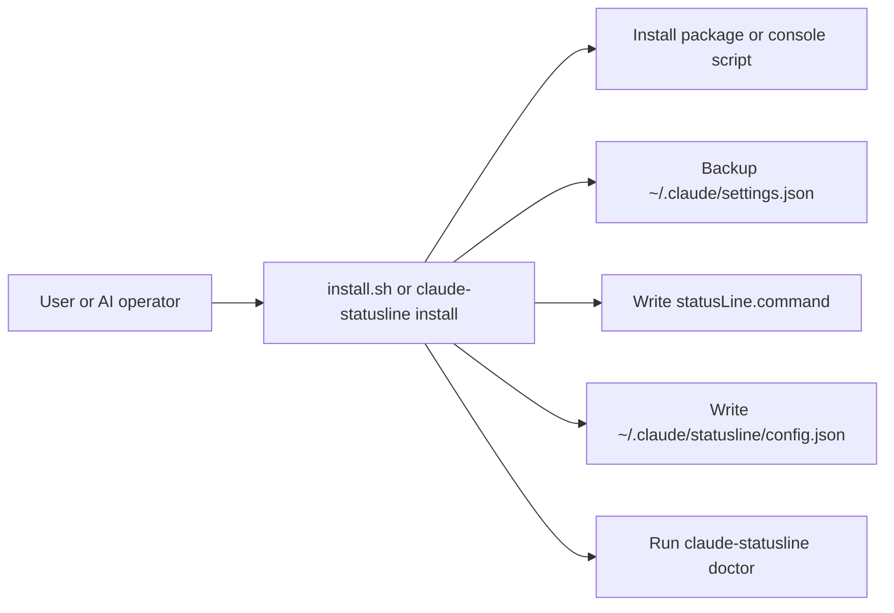
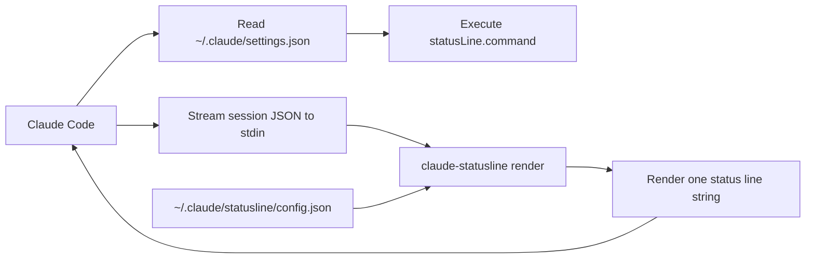

# Architecture

## Decision

This project is built as a standalone CLI with an optional skill wrapper.

The runtime path is:

1. Claude Code executes `statusLine.command`
2. Claude streams a JSON session payload to `stdin`
3. `claude-statusline render` reads that payload and prints one line
4. Claude displays that line in the status area

## Data flow

### Install flow

### Runtime flow

## Why not skill-only

Skills are useful for agent workflows, but they are the wrong dependency for a status line:

- normal users may not have the same agent environment
- runtime behavior should not depend on an LLM tool layer
- installation must be scriptable and repeatable
- status-line refreshes should stay local, deterministic, and low-latency
- the same runtime should work whether a human installs it or an AI installs it

So the core is a CLI, and the skill is only an operator shell.

## Why keep a skill at all

The skill still earns its place, just not on the runtime path.

- It gives an AI operator a stable interface for install, doctor, preview, and uninstall.
- It avoids ad-hoc shell edits to Claude settings.
- It keeps human setup and AI-assisted setup aligned around the same CLI.

## Platform split

### macOS

Primary target in `0.1.0`.

- default Claude config directory: `~/.claude`
- shell command rendering uses POSIX quoting
- install path assumes `python3` exists

### Windows

Planned, partially scaffolded.

- Claude config directory becomes `%USERPROFILE%\\.claude`
- command rendering uses Windows command line quoting
- `install.ps1` exists, but Windows needs more verification around PATH and shell execution

## Managed files

- `settings.json`: only the `statusLine` block is written
- `config.json`: renderer preferences
- `install-state.json`: stores the managed command and latest backup path
- `backups/`: timestamped copies of pre-install settings

## Good future segments

The current default is `workspace | model | ctx`, but the next segments most worth adding are:

1. `permission`: the current permission mode
2. `git`: branch name and dirty state
3. `mcp`: failing MCP server count
4. `cost`: session cost from the Claude payload

For VS Code specifically, `ctx` remains the most valuable field. If the host editor does not
expose precise context usage, the correct fallback is to omit it or show an explicit unknown state
instead of inventing a fake number.
